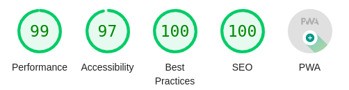

# About FTCScout

FTCScout is a new website that allows you to view teams, events, matches, and statistics for FTC in the vein of the [The Orange Alliance](https://theorangealliance.org/).

FTCScout is the passion project of a group of programmers at team [16321 X Drive](ftcscout.org/teams/16321). It was heavily inspired by the amazing websites [The Orange Alliance](https://theorangealliance.org/), [FTCScores](https://ftcscores.com/), [FTC Stats](http://www.ftcstats.org/), and [FTC Events](https://ftc-events.firstinspires.org/).

## Why FTCScout?

Although FTCScout provides similar features to other websites we believe it has several advantages:

### More Data

FTCScout provides more and more advanced statistics than any other website on the internet.

The rankings page for each event provides advanced statistics for each team for every aspect of the game in six categories: Total, Average, OPR, Min, Max, and Standard Deviation. For Freight Frenzy we tracked 191 statistics.

As well as viewing these statistics for each team at an event you can also view this data for the whole season using our highly advanced [Season Records Page](/records). This page provides the same data as the event rankings page but for every event of the season. In addition you can use our advanced filtering and sorting options to find even more information. For example here you can see the [rankings of our Autonomous OPR in California for the Freight Frenzy season.]({`ftcscout.org/records/2021/teams?region=California&filter=%7B"all"%3A%5B%7B"lhs"%3A"Team"%2C"op"%3A"%3D"%2C"rhs"%3A16321%7D%5D%7D&sort=Auto+Points+OPR`})

Finally FTCScout is designed to correctly handle remote events (both statistics and page layout) something that other websites struggle with.

### Fast, Secure, and Accessible

We designed FTCScout with performance, security, and accessability in mind. FTCScout pages load fast and with all data at the same time instead of popping in slowly like on some other websites. Because of these optimizations FTCScout receives near perfect [Google Lighthouse](https://en.wikipedia.org/wiki/Google_Lighthouse) scores and A+ security ratings from several auditors.

### Beautiful

Lastly, although this is a matter of opinion, we believe FTCScout is beautiful. We put a lot of effort into the design of FTCScout and think that it looks sleek, modern, and the best looking of the FTC websites.

## Our Team

FTCScout was developed by programmers at [16321 X Drive](ftcscout.org/teams/16321) however it is FOSS and you can contribute to it right now [on our Github](https://github.com/16321-X-Drive/ftc-scout).
