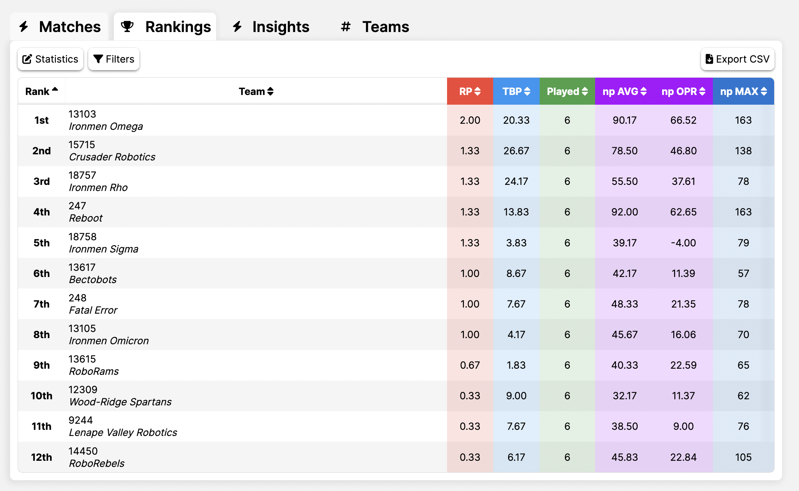
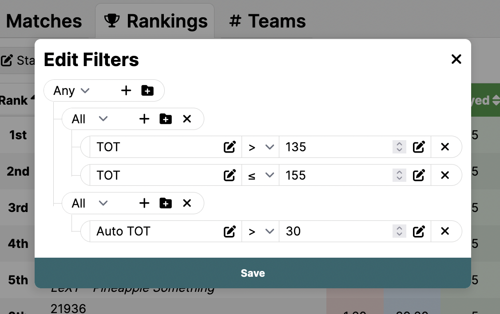
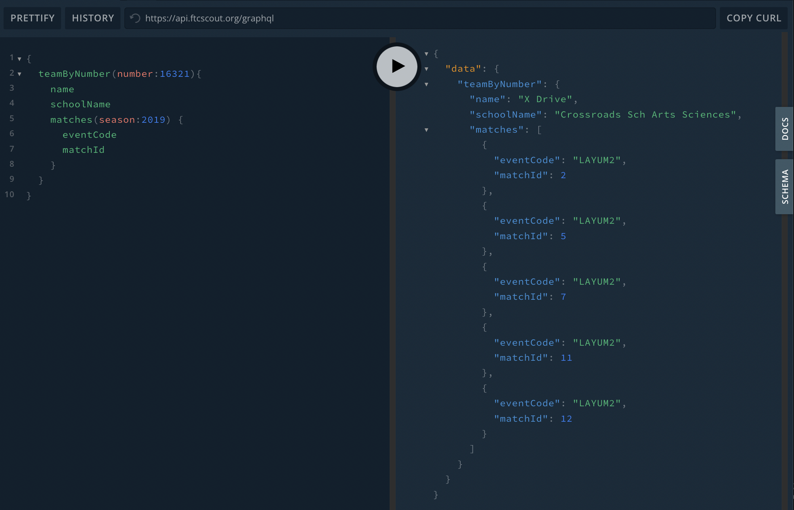

# FTCScout

FTCScout is a FIRST Tech Challenge (FTC) statistics website designed to provide the most detailed level of statistics analysis possible. It was inspired by [The Orange Alliance](https://theorangealliance.org/), [FTCScores](https://ftcscores.com/), [FTC Stats](http://www.ftcstats.org/), and [FTC Events](https://ftc-events.firstinspires.org/).

It includes advanced visualizations, including 3D field maps.

In addition, it provides detailed statistics and advanced filtering options

FTCScout also provides a comprehensive API for fetching information. You have the choice between using [GraphQL](https://api.ftcscout.org/graphql) or the [Rest API](https://ftcscout.org/api/rest) to query information.

